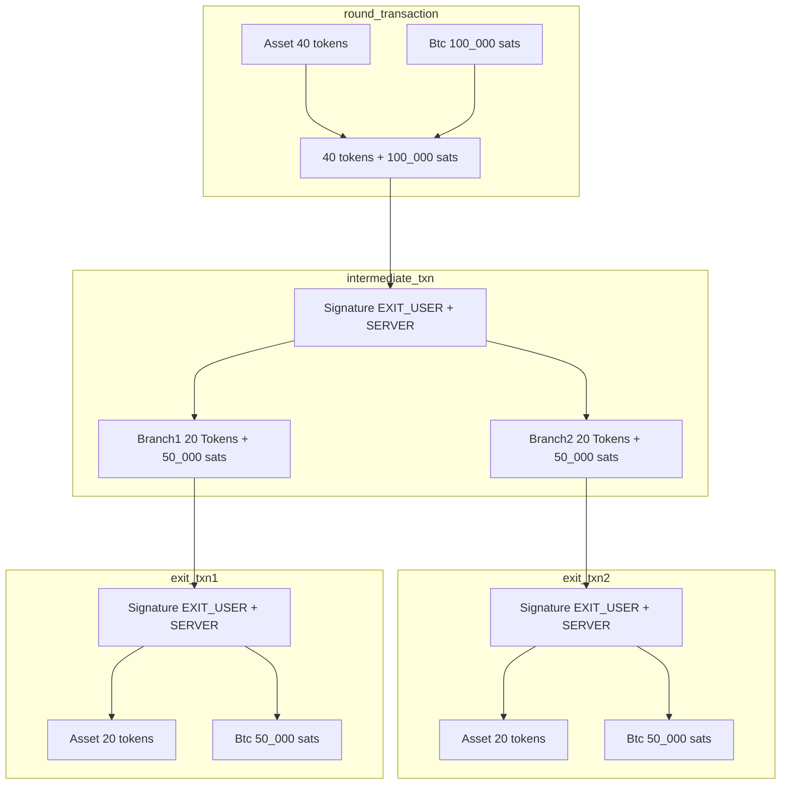

# Ark-Taproot-Asset PoC 🔗  
*A Proof of Concept for Integrating Taproot Assets with the Ark Protocol*

---

## 🧠 Overview

**Ark-Taproot PoC** is an proof of concept CLI App that demonstrates how **Taproot Assets** can be integrated into the **Ark Protocol**. The project uses a local Docker network (configured externally) to simulate interactions with a Taproot Assets daemon (`tapd`) and a Bitcoin node. The primary interface is an interactive REPL where you can issue commands to deposit btc, mint assets,  onboard asset and btc, view asset and btc balance, amongst others.

This PoC is intended for research and prototyping purposes only.

---

## 📦 Getting Started

1. **Clone the Repository:**

   ```bash
   git clone https://github.com/yourusername/ark-taproot-poc.git
   cd ark-taproot-poc
   ```

2. **Configure Network And Run :**

    There are three available networks that can be chosen from to run the POC. **Regtest**, **Signet** and **MutinyNet**.


    Before launching the network, you may need to adjust the connection settings for your Bitcoin client if custom bitcoin node is used. These settings are defined in a YAML file `cmd/config-{network}-yaml`. Open the file in your favorite text editor and modify the properties as needed:

    ```yaml
    bitcoin_client:
      host: "localhost"    # Replace with your Bitcoin node's hostname or IP
      port: "18443"                           # Ensure this is the correct port for your setup
      user: "ceiwHEbqWI83"                    # Update with your RPC username
      password: "DwubwWsoo3"                  # Update with your RPC password

    signet_challenge: 512102f7561d208dd9ae99bf497273e16f389bdbd6c4742ddb8e6b216e64fa2928ad8f51ae
                                              # Signet challenge value; modify if Signet network is used
    ```


   ```bash
   cd cmd
   docker compose -f ./docker-compose-regtest.yml up
   ```

   This network should start:
   - 1 Onboarding User `lnd` and `tapd` node.
   - 1 Exit User `lnd` and `tapd` node.
   - 1 Server `lnd` and `tapd` node.


3. **Launch the REPL:**

   Start the interactive REPL by running:

   ```bash
   cd cmd
   go run . -network {{network}}
   ```

   Once started, you will see a prompt where you can enter commands interactively.

---

##  Ark Tree Construction



 #### Things To Consider:
  - All leaves output goes to the Exit User both token and bitcoin
  - Both Asset and Bitcoin are split equally between transaction outputs
  - Fees are excluded from Transaction flow, but a fee of **10_000 sats** is included in all transactions
    
[Proof Of Concept Demo Video](https://github.com/user-attachments/assets/3afe6f84-65f4-4eed-9c3e-24471046ad5e)
## 🛠 REPL Usage

Within the REPL, you can issue commands to interact with the Taproot Assets and Ark Protocol. Some example commands include:

- **Issue a  100k Token for the Boarding User :**

  ```bash
  >> mint
  Asset ID: 10289bf353cbca99715b138852dda43fa60d813384874557870080f1ebfde5e3
  2025/03/31 15:44:49 -------------------------------------
  2025/03/31 15:44:49 Minting Complete
  2025/03/31 15:44:49 ----------------------------------------------
  ```
- **Get A BTC Deposit Address for the Onboarding User :**
    ```bash
    >> deposit
    2025/03/31 15:52:37 
    Deposit Address For Onboarding User : bcrt1p7zaqe4qddflre826pk8zu64xt3pl690mgav7cqmrq95984v5f78skq72mv
    2025/03/31 15:52:37 -------------------------------------
    2025/03/31 15:52:37 Deposit Address Gotten
    2025/03/31 15:52:37 -----------------------------------------------
    ```

- **List Balances For both the Onboarding User and Exit User:**

  ```bash
  >> balance
  2025/03/31 15:49:55 ------Boarding User-----
  2025/03/31 15:49:55 Asset Balance = 100000
  2025/03/31 15:49:55 Btc Balance = 298760564
  2025/03/31 15:49:55 -------------------------------------
  2025/03/31 15:49:55 -----Exit User------
  2025/03/31 15:49:55 Asset Balance = 0
  2025/03/31 15:49:55 Btc Balance = 442500
  2025/03/31 15:49:55 -------------------------------------
  ```

- **Onboard 40 tokens and 100_000 sats to the Ark Server**

  ```bash
  >> board
  2025/03/31 15:59:30 Boarding Asset TxId 3b0d25dca57a62fca3184337c02d09e1b132bddeb2eb0794c519517369b3dd64
  2025/03/31 15:59:30 Boarding BTC TxId fa501e10e8c3d9448934d78b44f9ed2da6f4e7ffd5a9d7589c4cf2b271827f44
  2025/03/31 15:59:30 awaiting block to be mined
  2025/03/31 15:59:58 Boarding User Complete
  2025/03/31 15:59:58 ------------------------------------------------
  ```

- **Create and Broadcast a Round transaction:**

  ```bash
  >> round
  2025/03/31 16:12:15 awaiting confirmation
  2025/03/31 16:12:21 
  Round Transaction Hash 38ebaa12c552231903d4f37dad6c6573223ddf87045d5f7541f8c664daf1784a
  2025/03/31 16:12:21 Round Construction Complete
  2025/03/31 16:12:21 ------------------------------------------------
  ```

- **Create and Broadcast a Round transaction:**

  ```bash
  >> round
  2025/03/31 16:12:15 awaiting confirmation
  2025/03/31 16:12:21 
  Round Transaction Hash 38ebaa12c552231903d4f37dad6c6573223ddf87045d5f7541f8c664daf1784a
  2025/03/31 16:12:21 Round Construction Complete
  2025/03/31 16:12:21 ------------------------------------------------
  ```

- **View Round Ark Tree:**

  ```bash
   >> tree
  └── (cd69bc566a08eb050c009f082db1d6341879e75806020393920f3c957aa534da, Token 40, BTC 81000)
      └── (75cd6dc683f41712c2638c4006e66295e4d010c4f042aefda65166beee9ff935, Token Vtxo [20], BTC Vtxo [29500])
      └── (3983764f11e999d957e2575a82916405714cc4757468cadede1e1c5d11fc7672, Token Vtxo [20], BTC Vtxo [29500])
  2025/04/07 17:11:03 Print Of Round Complete
  2025/04/07 17:11:03 ------------------------------------------------
    ```

 - **Unilaterally Exit Ark Round:**
  ```bash
  >> unilateral
  2025/03/31 16:29:11 awaiting confirmation
  2025/03/31 16:29:21 awaiting confirmation
  2025/03/31 16:29:51 awaiting confirmation
  2025/03/31 16:30:21 Exit Proof appended
  2025/03/31 16:30:21 Exit Proof Imported
  2025/03/31 16:30:21 Exit Transactions Broadcasted and Token Transfer Proof Appended
  2025/03/31 16:30:21 ------------------------------------------------
  ```

  - **Publish the Token Transfer Proof to Ensure the Balance is Updated in Tapd:**
  ```bash
  >> upload
  2025/04/07 17:20:15 Proof Uploaded
  2025/04/07 17:20:15
  -----------------------------------------------
  ```
  __Note:__ : upload command should be called twice to send both **20 token** transfer proofs to Tapd.
 
 - **Exit The Repl**
  ```bash
  >> exit
  Goodbye!
  ```

  **Note**: Please ensure that a minimum total of 200,000 sats is deposited for the Onboarding User, divided into two installments of 100,000 sats each. This deposit is essential for both Minting and creating the Boarding Transaction.

---

## 📁 Project Structure

```
taponark/
├── cmd/
    ├── app.go            # Core logic for the interactive commands 
│   └── main.go           # The REPL entry point for interactive commands
├── ark.go                # Logic necessary for the creation of Ark Specfic Boarding and Round Spending Condition
│                           Also contains condition for signing Ark Specific Boarding and Boarding Scripts
├── boarding.go           # Contains the construction and broadcastiong  of BTC boarding transaction and Asset          │                           Boarding Transaction
├── round.go              # Contains Logic to construct round, round tree offchain transactions and broadcast the round │                           transaction
├── proof.go              # Contains Logic to update asset transfer proofs and to publish such transfer proofs to tapd
├── tree.go               # Contains Logic to create Ark Round Tree 
├── bcoin.go              # Bitcoind specific RPC interaction logic  
├── lnd.go                # Lnd specific GRPC interaction logic
├── tap.go                # Tapd specific GRPC interaction logic
├── config.go             # Includes Configuration Details for Server, Onboarding User and Boarding User   
└── README.md
```

---

## Considerations

To simplify the import of asset proofs needed for our proof-of-concept, we employed a modified Tapd daemon that exposes a development RPC called **ImportProof**.


## 🧠 Motivation

This proof-of-concept explores the feasibility of integrating Taproot Assets into the Ark Protocol. By leveraging a Dockerized network and an interactive REPL.

---

## 📜 License

MIT

---

